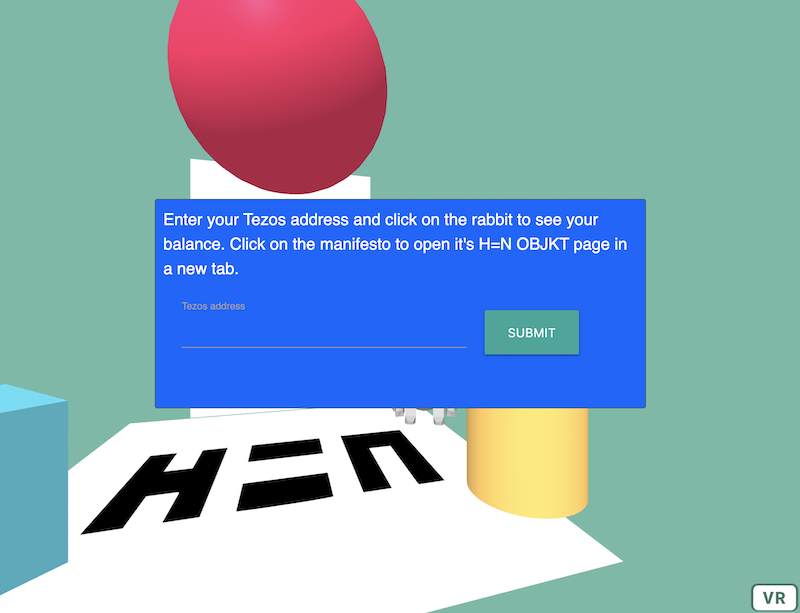

# H=N VR Experiments Playground 

## DEPRECATED: This repository has been deprecated

**This repository has been deprecated in favour of a proper tutorial.** 

Please check out the updated version here: [https://github.com/i3games/hen-metaverse-tutorial-1](https://github.com/i3games/hen-metaverse-tutorial-1)

Enter your wallet address.    
Click on the rabbit and it will tell your balance.    
Click on the manifesto and it will open it's OBJKT page from where you can collect it.    

Built with [A-Frame](https://aframe.io/) and [Taquito](https://tezostaquito.io).

Prerequisites: [node.js/npm](https://nodejs.org/)

Download or clone this repo. 

To install, run: `npm install` in the main folder

DO NOT upgrade the (deprecated) parcel bundler, newer versions have problems with static files such as 3d model formats. DO NOT downgrade either. The working configuration is "parcel-bundler": "1.12.5" and "parcel-plugin-static-files-copy": "2.6.0".

To start, run: `npm run watch`, then open http://localhost:1234 in the browser.

rabbit model: Copyright (c) platyperson, sketchfab.com, [CC BY 4.0](http://creativecommons.org/licenses/by/4.0/)
